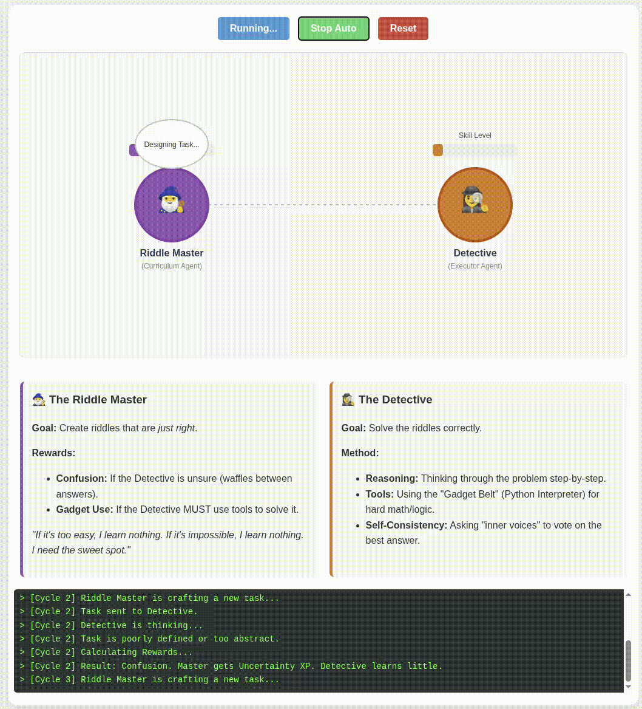

# Agent0 Interactive Analogy

This project provides an interactive visualization of the **Agent0** framework described in the paper "Agent0: Unleashing Self-Evolving Agents from Zero Data".

- **Paper:** [arXiv:2511.16043](https://arxiv.org/abs/2511.16043)
- **Code:** [GitHub Repository](https://github.com/aiming-lab/Agent0)
- **GitHub Page:** [GitHub Example](https://fraher.github.io/intuitive_pdf/)

## How to Run
Simply open the `index.html` file in any modern web browser.

## The Analogy
The visualization uses a "Riddle Master vs. Detective" analogy to explain the complex reinforcement learning concepts:

- **The Riddle Master (Curriculum Agent)**: Tries to create tasks that are challenging but solvable. It gets "points" (rewards) when the Detective is confused or has to use tools.
- **The Detective (Executor Agent)**: Tries to solve the tasks. It gets "points" for correct answers. It has a "Gadget Belt" (Tools) to help with hard problems.

## Key Concepts Visualized
- **Co-evolution**: Both agents level up together until they reach "Convergence" (Max Level).
- **Tool Integration**: The Detective uses tools, which forces the Master to create harder tasks.
- **Uncertainty Reward**: The Master benefits when the Detective is unsure.
- **Failure Modes**: The simulation shows what happens when tasks are "Too Easy" (No reward) or "Confusing" (Uncertainty reward only).

## Simulation Controls
- **Run Cycle**: Manually triggers one iteration of the training loop.
- **Auto Play**: Runs the simulation continuously until the agents converge.
- **Reset**: Resets the agents to level 1.

## Generated Page

